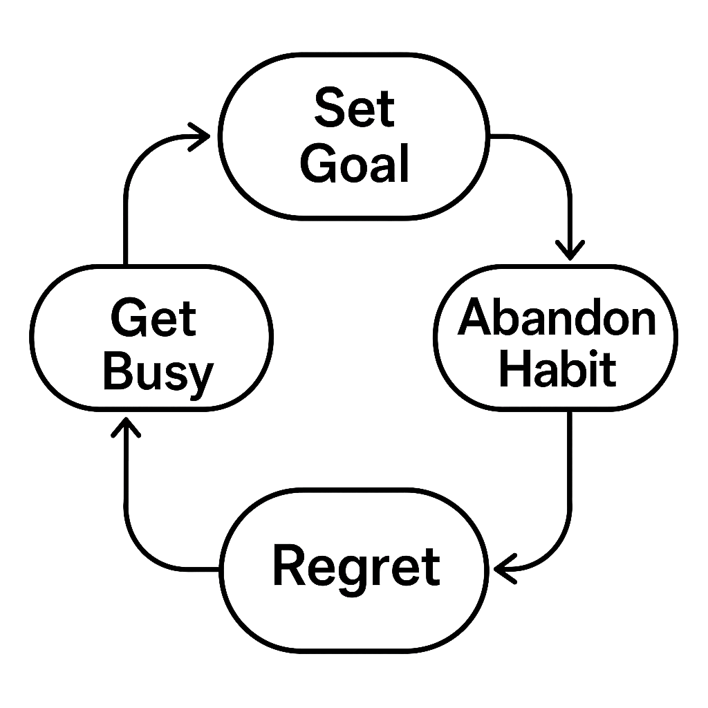
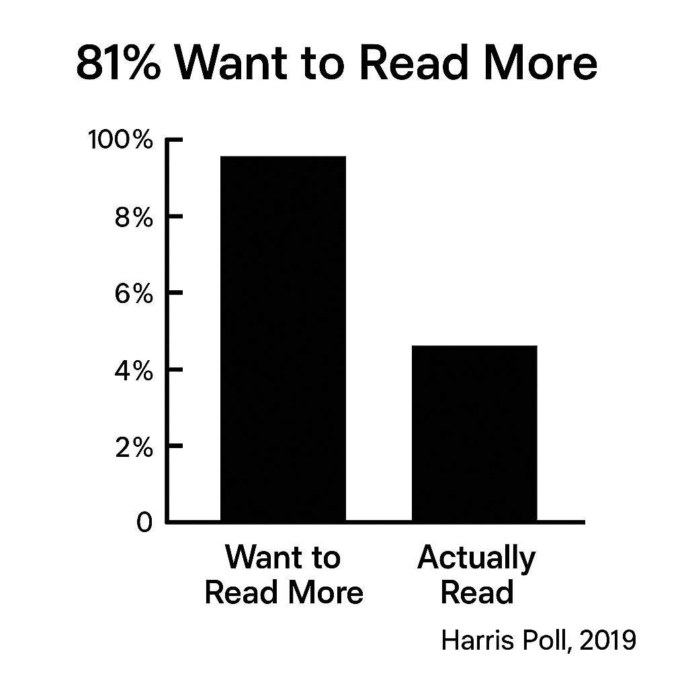
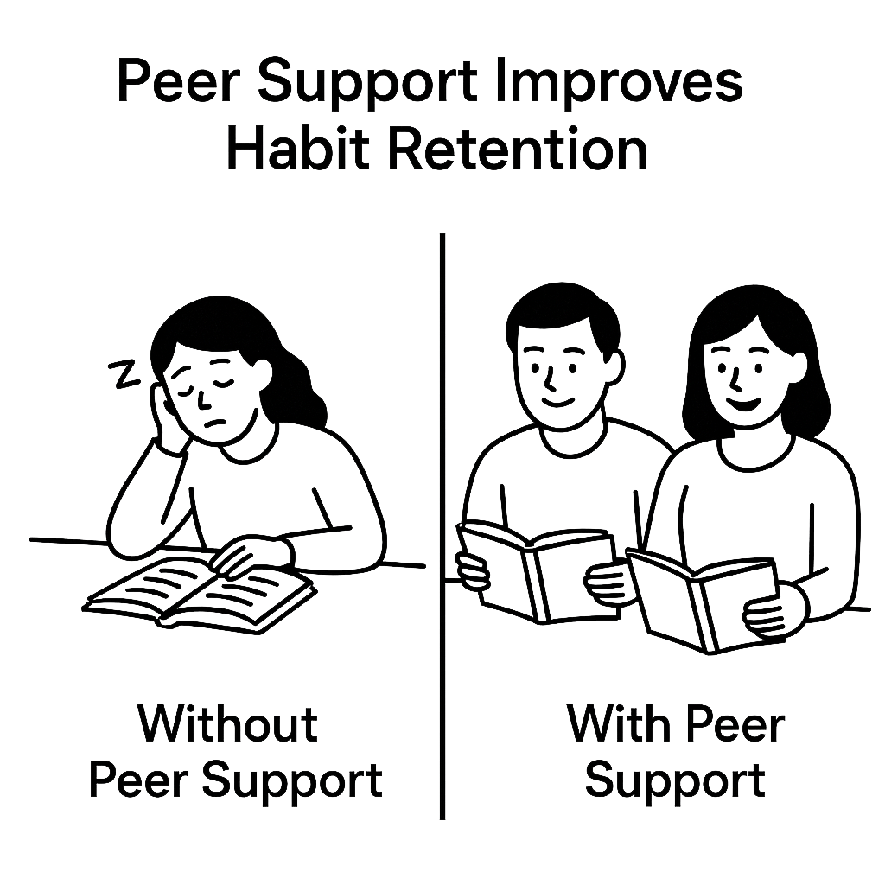
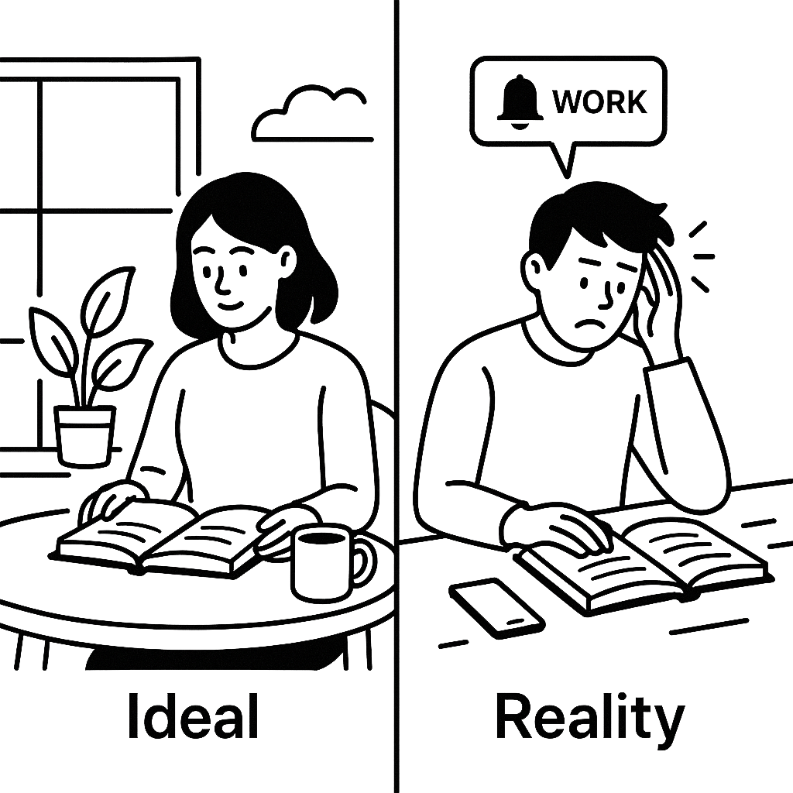
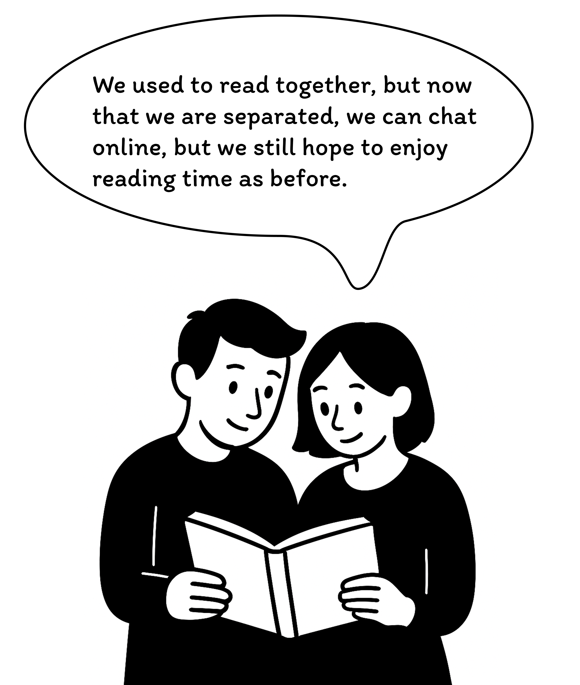
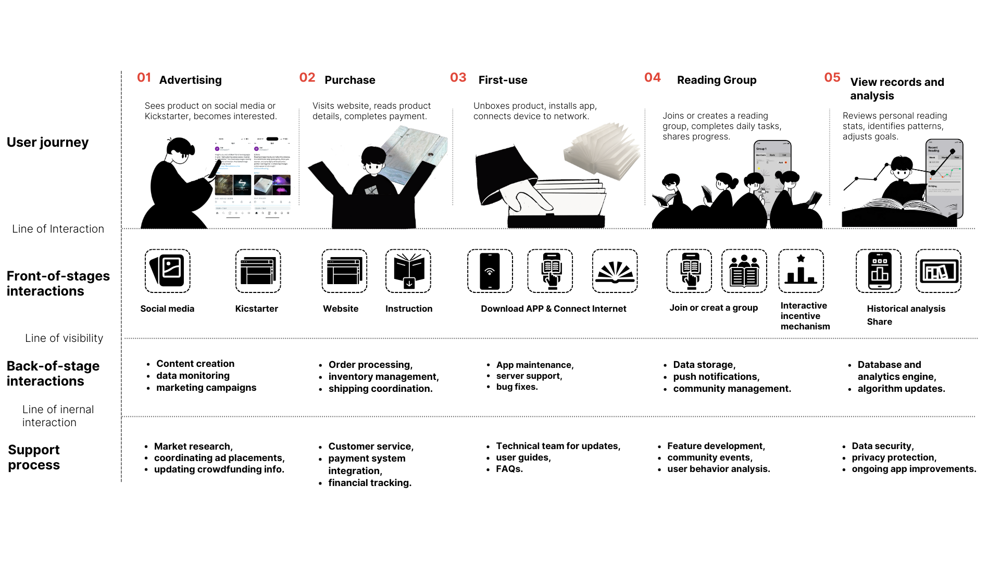

  

🎥 Click the image above to watch [LitMate video](https://www.youtube.com/watch?v=BeWCd5zH7cs)

## **1.What is LitMate?**

### 1.1 Brief
LitMate is a smart book light that combines IoT technology and behavioural development concepts，utilizing MQTT protocol to support the development of consistent reading habits. It enables remote users to share reading status for mutual companionship and accountability. The angle of the lamp's pages visualizes Pomodoro timing, while light effects indicate reading states. Paired with a dedicated app, LitMate offers device control, reading history tracking, and social features, forming a reading-centered digital community.
 

### 1.2 Background

|  |  |  |  |
|:---:|:---:|:---:|:---:|
| *Fig 2. Reading Cycle* | *Fig 3. Reading Statistics* | *Fig 4. Comparison* | *Fig 5. Split Scene* |

Many readers fall into a recurring cycle: setting goals, facing time constraints, giving up, regretting, and restarting. According to a 2019 Harris Poll, 81% of U.S. adults report not reading as much as they wish due to limited time. Behavioral research on the "false hope syndrome" explains this pattern of repeated failure and renewed intention (Polivy & Herman, 2002). Social support, such as reading with friends, significantly improves habit adherence—peer accountability increases consistency (Wing & Jeffery, 1999). Thus, integrating social mechanisms may effectively transform reading into a sustainable habit.

### 1.3 Target Users

|  |  |  |
|:---:|:---:|:---:|
| *Fig 6. Individual reading fan* | *Fig 7. Family reading group* | *Fig 8. Remote reading friends* |

- **Individual reading fan**: Individuals who wish to dedicate time to professional reading while being encouraged by a remote companion.
- **Family reading group**: Families who want to build a reading habit together, allowing parents to virtually accompany their children even when apart.

- **Remote reading friends**: People who seek a shared experience despite being in different locations, making reading a form of remote interaction.

In real life, reading is often a highly isolated behaviour. Most people usually read alone at home, lacking companionship and interaction with peers. In the long run, this isolation tends to lead to a decline in reading motivation and difficulty in maintaining the habit.

LitMate is designed to respond to this pain point: by building digital interaction mechanisms and social connectivity features, it helps different types of users to gain a sense of companionship in reading. Specifically, LitMate aims to provide a sense of belonging to an online community for individual readers, and at the same time supports status synchronisation and real-time interaction between remote reading partners, alleviating the barrier brought about by physical distance. Through the combination of technology and emotion, LitMate aims to enhance the social connection during the reading process and promote the long-term sustainability of reading behaviour.

## **2.Product Design**

*Fig 9. Design Sketch*

### 2.1 Design
- **Design Sketchs**:

### 2.2 Enclousure
- **3D Modeling**: Provides standard Pomodoro timing functionality with customizable work and rest cycles.
- **Lasercutting**: Features adjustable brightness and color temperature to suit different reading needs.
- **Material Selection**: Seamless integration with a user-friendly mobile app for remote control and settings management.

### 2.3 Paper-folding
- **First Attempt**: Provides standard Pomodoro timing functionality with customizable work and rest cycles.
- **djAustable Book Light**: Features adjustable brightness and color temperature to suit different reading needs.
- **Final Version**: Seamless integration with a user-friendly mobile app for remote control and settings management.

## **3.Hardware & Coding**

### 3.1 Compnents & Circuit Design
- **Smart Pomodoro Timer**: Provides standard Pomodoro timing functionality with customizable work and rest cycles.
- **Adjustable Book Light**: Features adjustable brightness and color temperature to suit different reading needs.
- **Mobile App Control**: Seamless integration with a user-friendly mobile app for remote control and settings management.
  
### 3.2 MQTT

## **Application for LitMate**

1. **Hardware Setup**: Ensure the LitMate book light timer device is properly purchased and installed.
2. **Software Installation**:
   - Download the LitMate mobile app from your device's app store
   - Follow the in-app setup instructions
   - Connect your device via Bluetooth

## **4.Application for LitMate**
### 4.1 Compnents & Circuit Design
- **Smart Pomodoro Timer**: Provides standard Pomodoro timing functionality with customizable work and rest cycles.
- **Adjustable Book Light**: Features adjustable brightness and color temperature to suit different reading needs.
- **Mobile App Control**: Seamless integration with a user-friendly mobile app for remote control and settings management.
  
### 4.2 MQTT

1. **Hardware Setup**: Ensure the LitMate book light timer device is properly purchased and installed.
2. **Software Installation**:
   - Download the LitMate mobile app from your device's app store
   - Follow the in-app setup instructions
   - Connect your device via Bluetooth
  

## **How does LitMate work throughout its lifecycle?**
### ServiceBluprint

- **Enhanced Focus**: Implements the Pomodoro Technique to help users work in focused segments.
- **Optimal Reading Environment**: The book light's soft illumination effectively reduces eye strain and improves reading experience.
- **Smart Integration**: Combines lighting and time management in one device for a streamlined user experience.

## **5. Limitations & Future**

- **Prototype Design**: Early design sketches, prototypes, and user testing feedback.
- **Version History**: Documentation of major improvements and feature evolution from initial to current version.
- **Future Plans**: Description of planned features, potential applications, and upcoming improvements.

## **6. Contributing Team**

- **Maintainers**: Current maintenance team members, contact information, and roles.
- **Contribution Guidelines**: Detailed instructions for submitting issues, pull requests, and code review process.
- **Community**: Information about joining the development community and contributing to the project.

## **7. Reference**
