<a href="https://www.youtube.com/watch?v=BeWCd5zH7cs">
  
</a>

🎥 Click the video above to watch [Your New Reading Partner](https://www.youtube.com/watch?v=BeWCd5zH7cs)


# **1.What is LitMate?**

### 1.1 Brief


LitMate is a smart book light that combines IoT technology and behavioural development concepts，utilizing MQTT protocol to support the development of consistent reading habits. It enables remote users to share reading status for mutual companionship and accountability. The angle of the lamp's pages visualizes Pomodoro timing, while light effects indicate reading states. Paired with a dedicated app, LitMate offers device control, reading history tracking, and social features, forming a reading-centered digital community.
<br clear="left"/>

### 1.2 Background

|  |  |  |  |
|:---:|:---:|:---:|:---:|
| *Fig 2. Reading Cycle* | *Fig 3. Reading Statistics* | *Fig 4. Comparison* | *Fig 5. Split Scene* |

Many readers fall into a recurring cycle: setting goals, facing time constraints, giving up, regretting, and restarting. According to a 2019 Harris Poll, 81% of U.S. adults report not reading as much as they wish due to limited time. Behavioral research on the "false hope syndrome" explains this pattern of repeated failure and renewed intention (Polivy & Herman, 2002). Social support, such as reading with friends, significantly improves habit adherence—peer accountability increases consistency (Wing & Jeffery, 1999). Thus, integrating social mechanisms may effectively transform reading into a sustainable habit.

### 1.3 Motivation


<p style="text-align: center;"><em>Fig 6. How to connect distant readers</em></p>

Reading often becomes an isolated activity, undermining motivation and habit formation. LitMate addresses this by offering digital interaction and social features, giving readers a sense of community and real-time connection—even across distances. Through combined technology and emotional support, LitMate aims to foster social bonds and sustain long-term reading.


<p style="text-align: center;"><em>Fig 7. What LitMate looks like in your home.</em></p>

# **2.Overall Design**
### 2.1 Target Users

|  |  |  |
|:---:|:---:|:---:|
| *Fig 8. Individual reading fan* | *Fig 9. Family reading group* | *Fig 10. Remote reading friends* |

- **Individual reading fan**: Individuals who wish to dedicate time to professional reading while being encouraged by a remote companion.
- **Family reading group**: Families who want to build a reading habit together, allowing parents to virtually accompany their children even when apart.

- **Remote reading friends**: People who seek a shared experience despite being in different locations, making reading a form of remote interaction.


### 2.2 ServiceBluprint: How does LitMate work throughout its lifecycle?
<a href="./Images/service_blueprint_map.pdf">
  
</a>

This service blueprint reveals all the touchpoints of user interactions from following the product LitMate to purchasing, using, socialising, and viewing records. And the support the team will provide in the background.

### 2.3 Product Design: Initial idea VS Final sketch

<table>
  <tr>
    <td style="text-align: center;">
      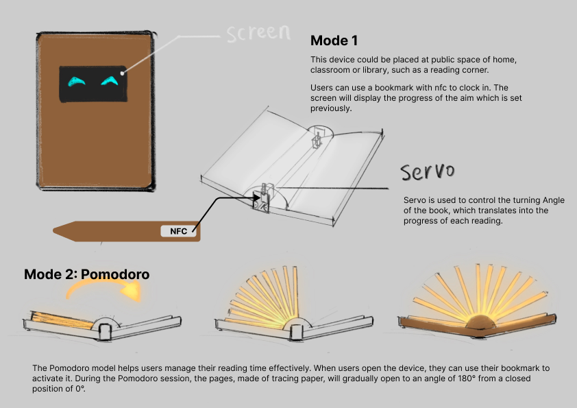
      <p><em>Fig 11. Initial sketch</em></p>
    </td>
    <td style="text-align: center;">
      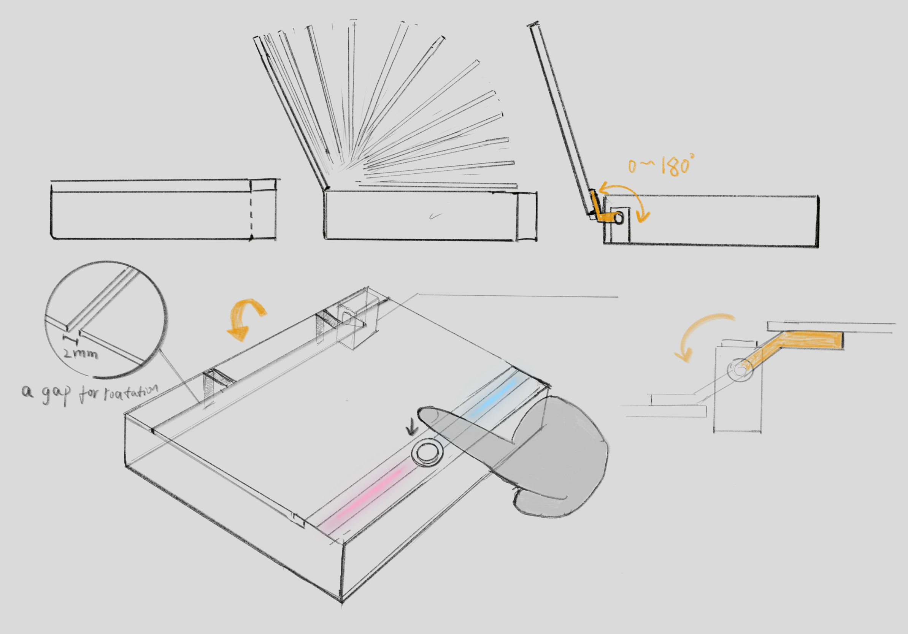
      <p><em>Fig 12. Final Sketch</em></p>
    </td>
  </tr>
</table>

Initially conceived as an "intelligent book" with a smart display on the cover for reading progress and celebratory animations, LitMate's design evolved through iterative testing. Hardware constraints—particularly the servo motor's thickness—made a slimmer book-like form factor unfeasible. In response, the team replaced the screen-based interface with a simpler LED light strip, maintaining core interactivity while improving manufacturability and providing a clean, ambient reading experience.

# **3.Physical Devices & Fabrication**

<p style="text-align: center;"><em>Fig 13. Hardware components selection</em></p>

### 3.1 Hardware Selection
The hardware selection was based on the need to create an interactive, remote-synchronized reading lamp that could effectively communicate user progress and status. The following components were chosen:

- **ESP32**: Acts as the central controller, supporting WiFi and MQTT communication for remote synchronization.
- **SW420 Vibration Sensor**: Used to detect light touches, allowing users to interact with the lamp and change the lighting state.
- **Servo Motors (x2)**: Responsible for controlling the book's opening and closing mechanism.
- **WS2812B LED Strips (4 sections, 8 LEDs each)**: Seamless integration with a user-friendly mobile app for remote control and settings management.
- **Button Switch (4 sections, 8 LEDs each)**: Momentary stainless steel push button, used for different interactions—short press for progress display and long press for power control
- **Separate Power Supply**: 4 x AA 6V battery holder case, added to ensure stable operation, avoiding power shortages.

The selection of these components balances simplicity and functionality while ensuring the device can accurately track reading progress and provide intuitive feedback.


### 3.2 Enclousure
#### 3.2.1 3D Modeling

<p style="text-align: center;"><em>Fig 14. 3Dmodeling in Rhino</em></p>
By physically placing the necessary internal components, the team constructed a 3D model of the book-shaped enclosure using the Rhino modeling software. Through multiple iterations of prototyping, the layout of components and the dimensions of the shell were progressively refined to achieve an optimal balance between structural compactness and user usability.

#### 3.2.2 Lasercutting

<p style="text-align: center;"><em>Fig 15. Lasercuting</em></p>
After finalizing the product dimensions and hole placements, the 3D model was decomposed into 2D sheet components suitable for laser cutting. The DWG files were then imported into Illustrator for layout adjustments and detail refinement, and subsequently exported as PDF files for fabrication via laser cutting.

#### 3.2.3 Material Selection

<p style="text-align: center;"><em>Fig 16. Material interation</em></p>

- **Opal acrylic**: Opal acrylic offered a clean, soft aesthetic suited to reading environments. However, as the design evolved, the team sought broader color and texture options to enhance expressiveness and adaptability.
- **UVprint on clear acrylic**: UV printing allowed for rich visual expression by applying color and patterns to one side of the acrylic, producing a soft, diffused look on the opposite side. However, testing revealed peeling over time and poor adhesive compatibility, limiting its structural use.
- **Textured acrylic sheet**: In the final stage, the team chose textured acrylic sheets from [Etsy](https://www.etsy.com/uk/listing/882883609/incudo-golden-teal-smoky-acrylic-sheet?ref=yr_purchases) website for their distinctive visual qualities and emphasis on design identity, despite higher costs.

### 3.3 Paper-folding

<p style="text-align: center;"><em>Fig 17. Paper folding</em></p>

The origami-inspired structure underwent a major design transformation—from an initial fully folded configuration to a later approach utilizing edge adhesion. This modification significantly reduced the overall thickness, resulting in improved visual clarity and tactile performance during page unfolding and closing, thereby enhancing both usability and aesthetic quality.

### 3.4 Assembling


<p style="text-align: center;"><em>Fig 18. Assembling and interation</em></p>

Throughout the development process, modeling refinements, cutting file adjustments, material selection, and origami structure iterations progressed in an interwoven and iterative manner. These design components informed and influenced one another, ultimately resulting in a structurally coherent, visually appealing, and fabrication-ready version that laid the foundation for the finalized product.


# **4.Functional implementation and Programming**
<div style="text-align: center;">
    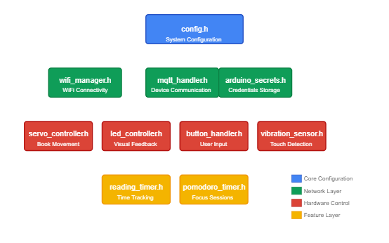
    <p><em>Fig 19. System architecture</em></p>
</div>


### 4.1 Modular Design Architecture

The LitMate system employs a modular design architecture that organizes functionality into specialized components with clear responsibilities and interfaces. This approach enhances code maintainability while enabling complex behaviors through component collaboration.
The architecture divides functionality into four distinct layers:

1. **Core Configuration (config.h)**: Centralizes system constants, pin definitions, and shared declarations.
2. **Network Layer**:or Sensitivity**: Handles connectivity (wifi_manager.h) and inter-device communication through MQTT (mqtt_handler.h, arduino_secrets.h).
3. **Hardware Control Layer**: Manages physical components including book movement (servo_controller.h), visual feedback (led_controller.h), user input (button_handler.h), and touch detection (vibration_sensor.h).
4. **Feature Layer**: Implements high-level functionality including reading time tracking (reading_timer.h) and Pomodoro focus sessions (pomodoro_timer.h).

### 4.2 Network Connectivity Implementation
The WiFi configuration system that ensures reliable network connectivity while providing a user-friendly setup experience. The system enables an automatic Access Point (AP) mode for initial configuration and persistent connection management.

#### 4.2.1Access Point (AP) Mode for User Network Setup
This AP mode, featured function by ESP32, serves as an entry point for users to configure their device without requiring specialized software or hardware tools.
The WiFi configuration system implements a dual-mode approach to network connectivity. The process follows a user-friendly flow as illustrated in the diagram below:

<div style="text-align: center;">
    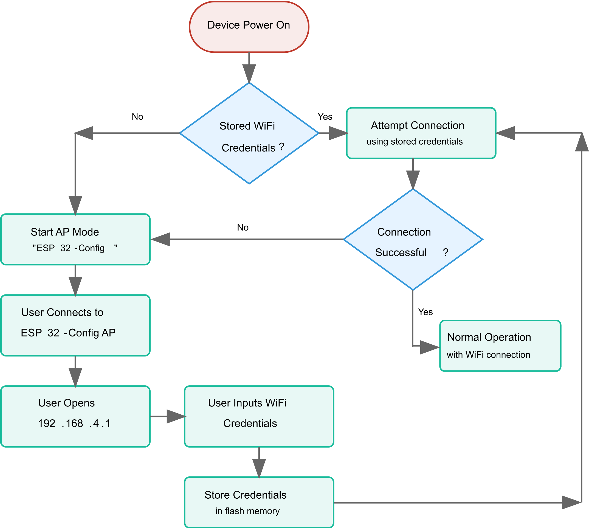
    <p><em>Fig 20. System architecture</em></p>
</div>

When the device starts, it first attempts to connect to previously configured networks using credentials stored in non-volatile memory. If no stored credentials exist or the stored network is unavailable, the system will switch to Access Point mode, creating a hotspot named "ESP32-Config"providing a clean, responsive HTML interface accessible at http://192.168.4.1. The web interface (shown below) presents simplified form layout, clear input fields for SSID and password which can be accessed across both desktop and mobile devices. 

<div style="display: flex; justify-content: space-between;">
    <div style="width: 48%;">
        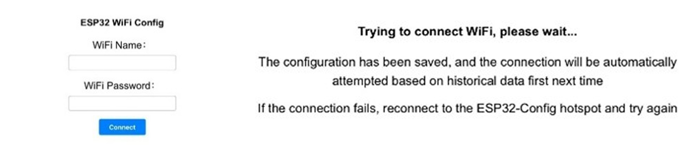
        <p style="text-align: center;"><em>Fig 21. Simple Web interface</em></p>
    </div>
    <div style="width: 48%;">
        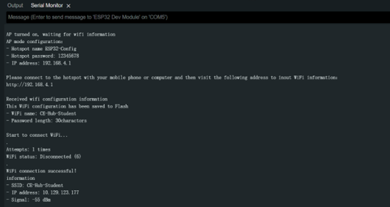
        <p style="text-align: center;"><em>Fig 22. Serial monitor output during AP mode</em></p>
    </div>
</div>

Once configured, the system maintains WiFi connectivity with automatic reconnection and fallback to AP mode when necessary. The serial monitor output (shown below) demonstrates the complete configuration process, from initiating AP mode to successfully connecting to the configured network.

### 4.2.2 MQTT Communication
LitMate system leverages MQTT protocol for reliable real-time communication between paired devices. MQTT is featured for its lightweight nature, publish-subscribe model, and excellent performance on constrained networks.

#### 4.2.3 Topic Structure
The system implements a carefully structured topic hierarchy designed to efficiently synchronize states between paired devices.
The core topics include:
- **reading status**: 
1`student/ucfnwy2/DeviceA/isReading
student/ucfnwy2/DeviceB/isReading

- **Daily cumulative reading time (in seconds)**: 
student/ucfnwy2/DeviceA/totalDailyTime
student/ucfnwy2/DeviceB/totalDailyTime

- **User interaction status**: student/ucfnwy2/isTouch
- **Light color**: student/ucfnwy2/lightColor

Each device subscribes to the other device's topics to maintain awareness of its partner's status. A screenshot of MQTT Explorer is shown below to present a clear topic structure.

<div style="text-align: center;">
    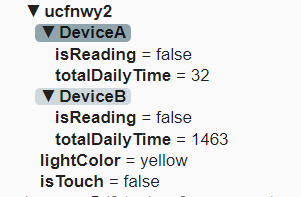
    <p><em>Fig 23. Serial monitor output during AP mode</em></p>
</div>

When significant state changes occur (book opening/closing, touch interaction, light color change), the device immediately publishes updates to the appropriate topics. The MQTT client maintains persistent connections with automatic reconnection mechanisms to ensure connected devices receive the latest state information.

Therefore, this lightweight communication framework enables the paired LitMate devices to maintain synchronized state and respond to each other's actions in real-time within seconds.

### 4.3 Core Reading Functionality
The core of LitMate's functionality revolves around its ability to physically interact with books, track reading sessions, and provide visual feedback through an integrated system of hardware control and state management.

#### 4.3.1 Pomodoro Timer 
The LitMate device incorporates a sophisticated Pomodoro timer that combines time tracking with physical visualization through servo motor positioning.

The Pomodoro functions are tightly integrated with the book state management system: When book is open, it start working, set an hour Pomodoro timer; When the full one-hour session completes, it triggers the book closure mechanism.

##### Servo Angle as Visual Progress Indicator
Another feature of LitMate's Pomodoro is the use of servo angle position as a physical progress indicator. As reading time advances, the servo motors adjust their position in 15-degree increments:

```cpp
if (currentStage != lastServoStage) {
        // Calculate new servo position: starting from 180 degrees, decreasing by 15 degrees per stage
        int targetPosition = 180 - (currentStage * DEGREES_PER_STAGE);
        
        // Smoothly move to the new position
        moveServosSmooth(180 - (lastServoStage * DEGREES_PER_STAGE), 
                          targetPosition, 
                          (lastServoStage < currentStage) ? 5 : -5, 
                          50);
        
        lastServoStage = currentStage;
    }

```

#### 4.3.2 Button Interaction Logic (Short Press vs. Long Press)
The system uses a single button interface with differentiated press durations to control multiple functions. The button handler utilise debouncing and timing mechanisms to distinguish between short and long presses:
- **Short Press**: Toggles the progress indicator LEDs on/off.
- **Long Press (for more than 3 seconds)**: Toggles the book's open/closed state.

```cpp
// Function to check button status
void checkButton() {
    // Read button state (LOW means pressed)
    int buttonState = digitalRead(BUTTON_PIN);
    
    // Button pressed
    if (buttonState == LOW && !buttonPressed) {
        buttonPressed = true;
        buttonPressTime = millis();
        longPressTriggered = false;
    } 
    
    // Button held down, check if long press duration is reached
    else if (buttonState == LOW && buttonPressed) {
        unsigned long pressDuration = millis() - buttonPressTime;
        
        // Long press duration reached and long press action not yet triggered
        if (pressDuration >= LONG_PRESS_TIME && !longPressTriggered) {
            toggleBook();         // Toggle the book's open/close status
            longPressTriggered = true;
            Serial.println("Long press detected, toggling book status");
        }
    }
    // Button released
    else if (buttonState == HIGH && buttonPressed) {
        unsigned long pressDuration = millis() - buttonPressTime;
        buttonPressed = false;
        
        // Short press - control LED lights
        if (pressDuration < LONG_PRESS_TIME && !longPressTriggered) {
            toggleLEDs();
            Serial.println("Short press detected, toggling LED status");
        }
        longPressTriggered = false;
    }
}
```

#### 4.3.3 Session-based and Cumulative Time Tracking
The system can distinguish between active reading sessions and cumulative daily reading time. When the book is opened, a new reading session begins. The system uses the millis() function to track time and records the start time and begins tracking the session duration. When the book is closed, the session duration is calculated and added to the cumulative daily reading time. This approach allows the system to maintain accurate time records even through multiple reading sessions throughout the day. The related code is shown below:
```cpp
// Start reading timer
void startReadingTimer() {
    startTime = millis();
    lastUpdateTime = startTime;
    Serial.println("Reading session started!");
    
    // Publish reading status to MQTT
    publishReadingStatus(true, dailyReadingTime);
}
// Stop reading timer
void stopReadingTimer() {
    if (startTime > 0) {
        unsigned long sessionTime = millis() - startTime;
        dailyReadingTime += sessionTime;
        Serial.print("Reading session ended. Session time: ");
        printTime(sessionTime);
        Serial.print("Total daily reading time: ");
        printTime(dailyReadingTime);
        
        // Publish reading status to MQTT
        publishReadingStatus(false, dailyReadingTime);
        
        startTime = 0;
    }
}
```

#### 4.3.4 Daily Reading Reset Mechanism
When a new day begins, the system logs the previous day's total reading time, resets the counter, and publishes the updated state to the MQTT network to ensure paired devices are synchronized.


### 4.4 User Interaction and Data Visualisation

#### 4.4.1 LED Indication System

##### Book Lamp
The main book lamp serves as both a reading light and a status indicator, using color and animation effects to visualise the device's state.

When both books are open, the Book Lamp will display a smooth "breathing" effect that provides ambient lighting, which enhances the reading experience across both users, creating a reading atmosphere.

```cpp
void updateBreathingEffect() {
    unsigned long currentTime = millis();
    if (currentTime - lastBreathTime >= BREATH_INTERVAL) {
        if (increasing) {
            brightness += 5;
            if (brightness >= 255) {
                brightness = 255;
                increasing = false;
            }
        } else {
            brightness -= 5;
            if (brightness <= 0) {
                brightness = 0;
                increasing = true;
            }
        }
	lastBreathTime = currentTime;
}
```
The book lamp color can be changed between pink (default) and yellow through the vibration sensor double-tap detection, which is design for interactive purposes to increase fun through readers:
```cpp
if (tapInterval > minTapInterval && tapInterval < doubleTapWindow) {
    // Toggle light color and publish
    isYellowColor = !isYellowColor;
    publishLightColor(isYellowColor);
    
    // Apply the new color to LEDs
    if (isYellowColor) {
        setLEDColor(255, 255, 0);  // Yellow
    } else {
        setLEDColor(255, 102, 178);  // Pink
    }
}

```
This color change is synchronized between paired devices, creating a shared visual experience between remote users.


#### 4.4.2 Progress Indicator LEDs

The system implements separate LED strips for each user, which can be identified by color, to visualise reading time for both the user's device and the paired device. The number of LED display logic is shown in code below:
```cpp
// Map reading time to LED display (8 LEDs represent progress thresholds)
    int ledsToLight = 0;
    if (totalSeconds < 450) {
        ledsToLight = 1;
    } else if (totalSeconds < 900) {
        ledsToLight = 2;
    } else if (totalSeconds < 1350) {
        ledsToLight = 3;
    } else if (totalSeconds < 1800) {
        ledsToLight = 4;
    } else if (totalSeconds < 2250) {
        ledsToLight = 5;
    } else if (totalSeconds < 2700) {
        ledsToLight = 6;
    } else if (totalSeconds < 3150) {
        ledsToLight = 7;
    } else {
        ledsToLight = 8;
    }
```

Also, these reading progress LEDs can be switched on and off via a short button press to conserve power, which is shown below:
```cpp
    if (!progressLEDsEnabled) {
        // Turn off both progress bar LEDs
        timeStrip.clear();
        timeStrip.show();
        
        deviceBTimeStrip.clear();
        deviceBTimeStrip.show();
    } else {
        // Re-enable progress bar LEDs
        updateTimeLEDs();
        updateDeviceBTimeLEDs();
    }
```

# 5. Application

### 5.1 Overview
The mobile application aims to provide users with a simple reading record and reading sharing experience. It ensures that users can record the current reading time and number of pages, and view past reading statistics through the app to achieve better development of reading habits.

### 5.2 Main Functions
#### 5.2.1 Recording reading time and pages

<div style="text-align: center;">
    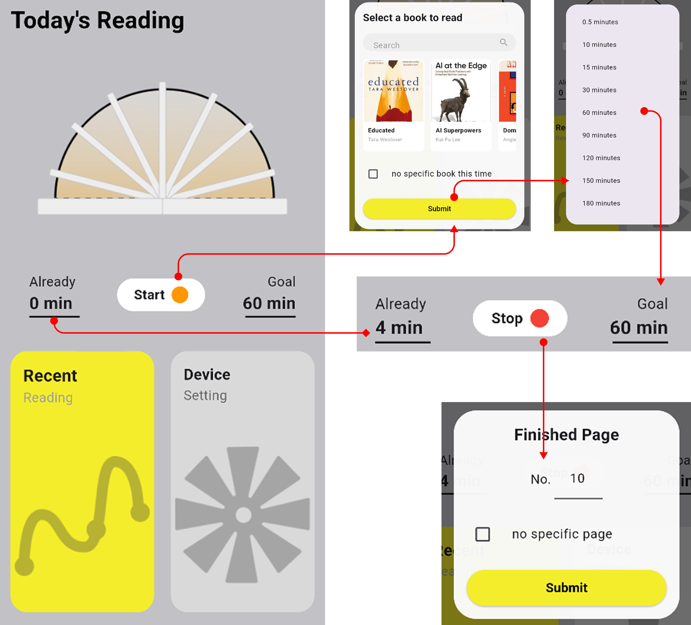
    <p><em>Fig 24. Interface for recording reading time and pages</em></p>
</div>

- Click on the 'Goal' button and select the goal for today's reading time in the pop-up window.
- Click on the 'Start' button to select the book you are going to read in the pop-up window (the data of the book in the pop-up window comes from the Library).
- After starting to read, the 'Already' text will show the length of time already read, users can click the 'Stop' button to stop reading records, you can enter the progress of this reading in the pop-up window that appears after clicking.


#### 5.2.2 Viewing Reading Statistics


<div style="text-align: center;">
    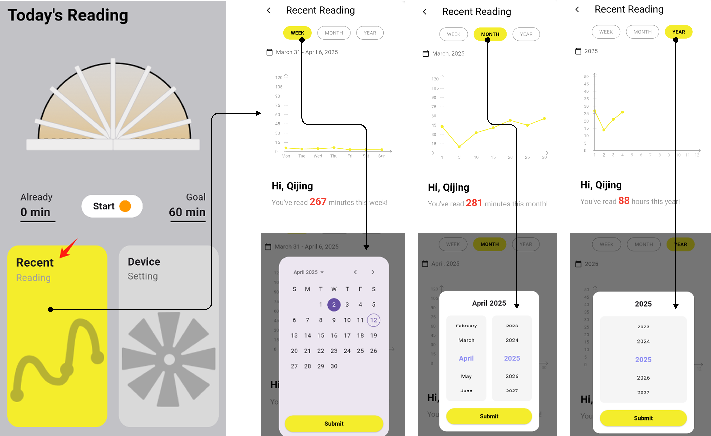
    <p><em>Fig 25. Reading statistics overview showing weekly, monthly, and yearly views with time selection</em></p>
</div>

- Click on 'Recent Reading' on the homepage to go to the statistics page. 
- Click on 'WEEK', 'MONTH', 'YEAR' to see reading statistics in different time units.
- Click on the calendar icon to select a time in the pop-up window

#### 5.2.3 Managing Personal Library

<div style="text-align: center;">
    
    <p><em>Fig 26. Personal library interface showing book collection with progress bars</em></p>
</div>

- The book cards on the Library page show each book's cover, title, author, and current reading progress bar.
- Click on the 'Add a new book' card to add a book to the e-library and enter information about the new book in the pop-up window.
- In the search box, you can enter the name of the book or author to search for existing book data.

#### 5.2.4 Managing Personal Library
Click the plus sign on the Group page to create a new group, and enter the group information in the pop-up window.
<div style="text-align: center;">
    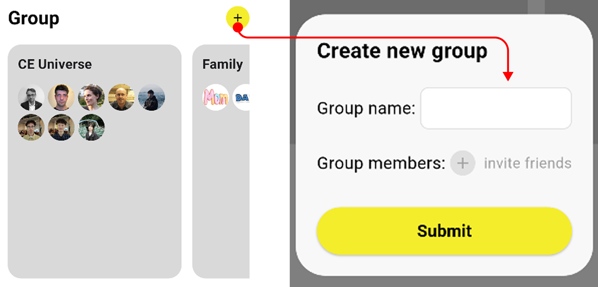
    <p><em>Fig 27. Group Photo</em></p>
</div>


Click on each Group card to see more information about the group, including the number of members currently reading, the ranking of reading hours for the month, and the books read by group members.
<div style="text-align: center;">
    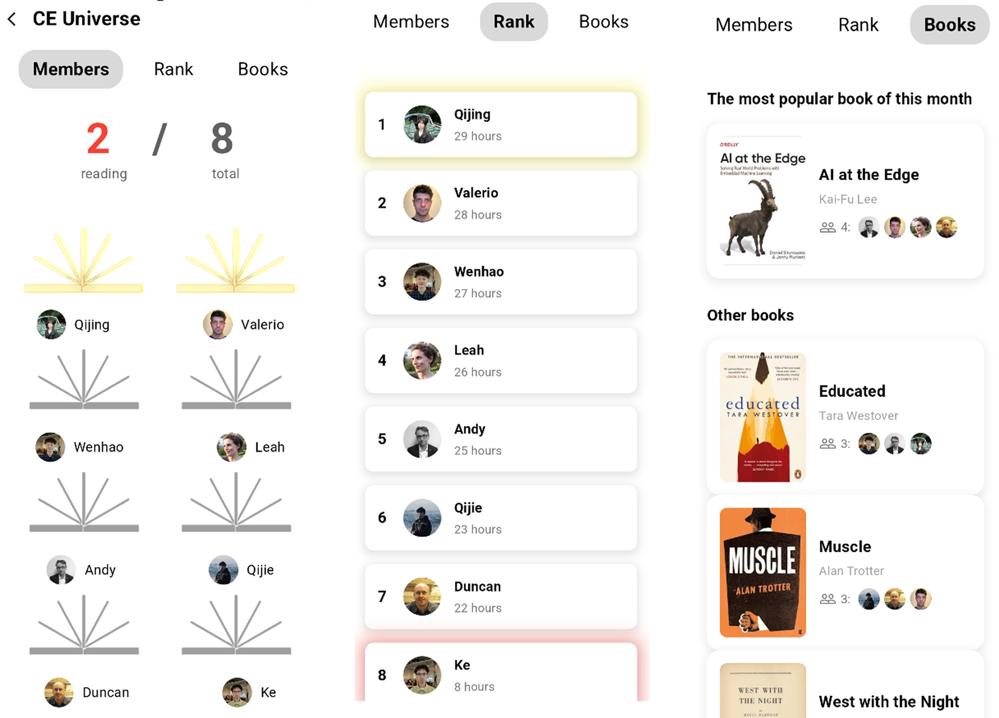
    <p><em>Fig 28. CEuniverse Team</em></p>
</div>


### 5.3 Interation
#### 5.3.1 Sketch

<div style="text-align: center;">
    
    <p><em>Fig 29. Initial sketches of the app interface design</em></p>
</div>

#### 5.3.2 Prototype

<div style="text-align: center;">
    
    <p><em>Fig 30. High-fidelity prototype of the app interface</em></p>
</div>

#### 5.3.3 Current Development

<div style="text-align: center;">
    
    <p><em>Fig 31. Current development status of the app interface</em></p>
</div>


# **6. Limitations & Future development**
### 6.1 More Possibilities in Design

<div style="text-align: center;">
    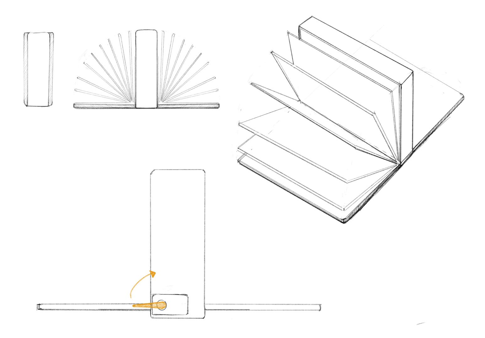
    <p><em>Fig 32. Future Design Possibilities</em></p>
</div>
Some of the advice about the product gained during the pitch made the team rethink about product design.

- **Size**: The team tends to reduce the size of the product in the next iteration by upgrading the hardware to make it more write and easy to use. In fact, the current product still has a lot of free space inside.
- **Visualisation**: For visualisation, the team preferred to make another prototype where the pages of the book could be opened from each side to represent the reading progress of both sides for a more intuitive comparison.

### 6.2 How to Improve Hardware of LitMate?
#### 6.2.1 Circuit Assembly and Challenges
The circuit was designed to be straightforward, focusing on ease of connection. However, the symmetrical layout made wiring more complex, leading to issues in organization and debugging. The key challenges faced during assembly were:
- **Complex Wiring Layout**: The symmetrical arrangement of components made routing difficult, increasing the risk of loose connections.
- **Power Supply Limitations**: The initial single power source was insufficient for stable operation, especially when driving multiple LEDs and servos.
- **Vibration Sensor Sensitivity**: The SW420 sensor was difficult to fine-tune, sometimes failing to detect subtle touches or triggering false readings.

To address these issues, some measures were taken :
1) Simplified the routing layout, reducing unnecessary wiring complexity.
2) Implemented a separate power supply, ensuring adequate power distribution.
3) Adjusted the sensitivity threshold of the SW420 sensor to improve its reliability.

#### 6.2.2 PCB Design
For the purpose of simplifying the hardware assembly of the product as well as reducing the size of the product. Designing a dedicated PCB is an ideal ending solution and the team has made the following attempts so far:

<div style="text-align: center;">
    
    
    <p><em>Fig 33. Circuit diagram and PCB Design</em></p>
Please refer to PCB folder for detailed design. The drawing tool used is EasyEDA.
</div>

### 6.3 Application

The current APP is limited to Android mobile phones and has not yet been linked to a physical book light, which could be developed in both directions in future developments and iterations: 
1) Develop different versions of the app for Android and IOS phones; 
2) Implement a digital twin between mobile application and physical book light, allowing users to control the book light on/off and synchronise the reading time recorded by the book light in the application.

### 6.4 Marketisation：Inability to finally recognise costs
Below are the current individual equipment costing：

| Component | Quantity | Subtotal (GBP) | Estimated Cost (GBP) | Notes |
|-----------|----------|---------------|---------------------|-------|
| ESP32 Development Board | 1 | £5.5-£8.8 | £7.2 | Main controller |
| SW420 Vibration Sensor | 1 | £0.55-£1.1 | £0.8 | For touch detection |
| Servo Motor | 2 | £3.3-£5.5 | £4.4 | Controls book opening/closing |
| WS2812B LED Strip | 4 segments (8 LEDs each) | £8.8-£13.2 | £11.0 | For status display |
| Push Button | 1 | £0.22-£0.55 | £0.4 | Stainless steel button |
| 4xAA Battery Holder | 1 | £0.55-£1.1 | £0.8 | 6V power supply |
| Acrylic Enclosure | - | £5.5-£11 | £8.3 | Including laser cutting cost |
| Other Components (Wires, Resistors, etc.) | - | £2.2-£3.3 | £2.8 | Basic electronic components |
| **Total** | - | **£26.6-£44.5** | **£35.7** | - |


The ultimate goal of the product is to sell it on kickstater, so the cost and selling price need to be considered, but there are two uncertainties at the moment: the **paper-folding work** needs to seek cooperation from manufacturers for mass production, and the **subsequent development and maintenance costs of the APP**.

# **7. Reference**
1) Polivy, J., & Herman, C. P. (2002). If at First You Don't Succeed: False Hopes of Self-Change. American Psychologist, 57(9), 677–689. https://doi.org/10.1037/0003-066X.57.9.677
2) Harris Poll (2019). Reading Habits Survey, conducted for Scribd. Summary available via Mental Floss by Garin Pirnia: 81% of people don't read as much as they want
3) Wing, R. R., & Jeffery, R. W. (1999). Benefits of recruiting participants with friends and increasing social support for weight loss and maintenance. Journal of Consulting and Clinical Psychology, 67(1), 132–138. https://doi.org/10.1037/0022-006X.67.1.132
