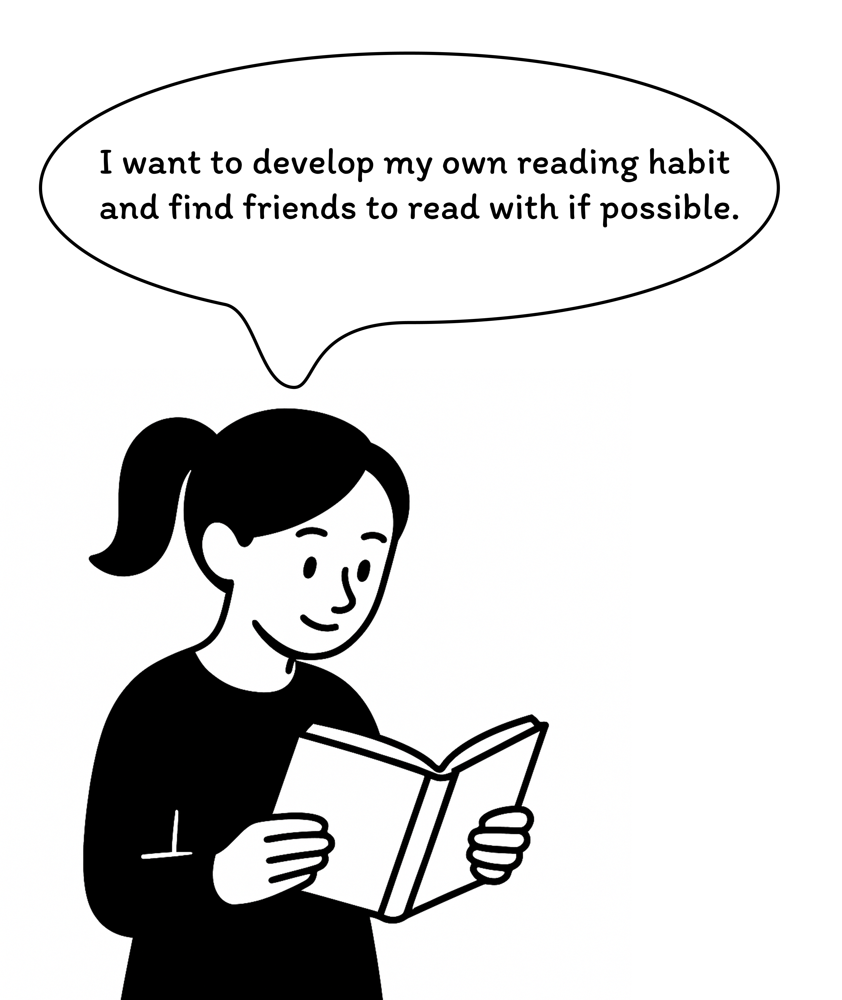
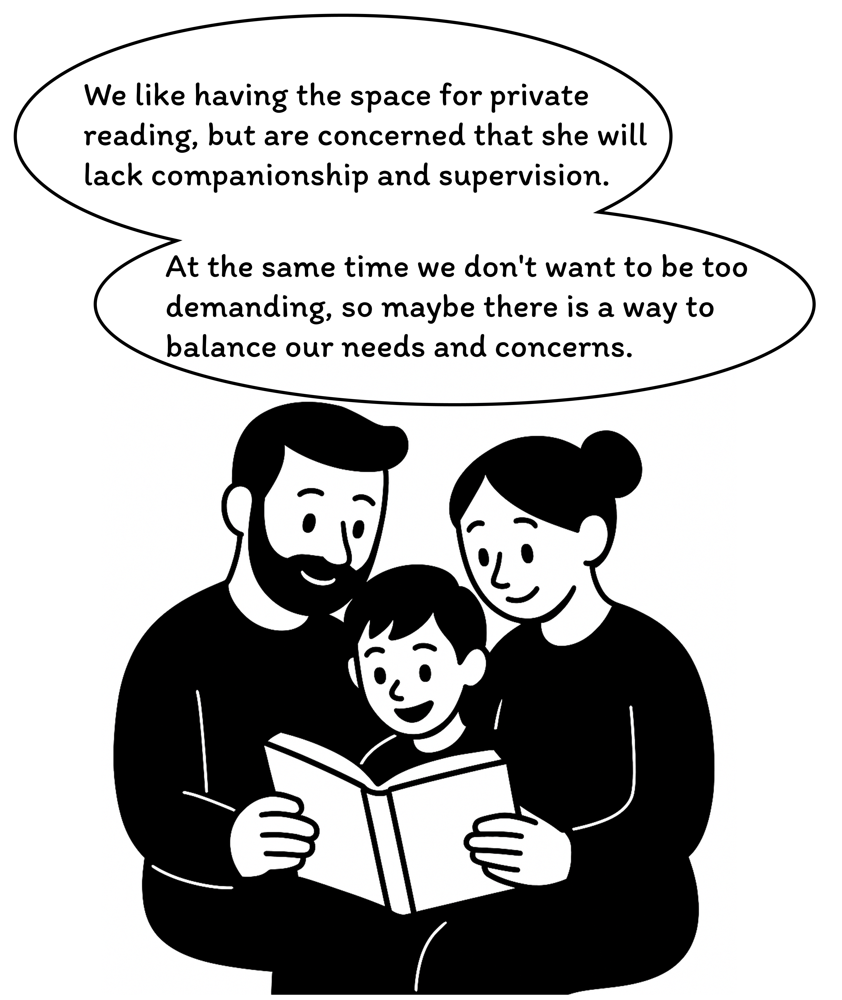

🎥 Click the video above to watch [Your New Reading Partner](https://www.youtube.com/watch?v=BeWCd5zH7cs)

## **1.What is LitMate?**

### 1.1 Brief

LitMate is a smart book light that combines IoT technology and behavioural development concepts，utilizing MQTT protocol to support the development of consistent reading habits. It enables remote users to share reading status for mutual companionship and accountability. The angle of the lamp's pages visualizes Pomodoro timing, while light effects indicate reading states. Paired with a dedicated app, LitMate offers device control, reading history tracking, and social features, forming a reading-centered digital community.
 

### 1.2 Background

|  |  |  |  |
|:---:|:---:|:---:|:---:|
| *Fig 2. Reading Cycle* | *Fig 3. Reading Statistics* | *Fig 4. Comparison* | *Fig 5. Split Scene* |

Many readers fall into a recurring cycle: setting goals, facing time constraints, giving up, regretting, and restarting. According to a 2019 Harris Poll, 81% of U.S. adults report not reading as much as they wish due to limited time. Behavioral research on the "false hope syndrome" explains this pattern of repeated failure and renewed intention (Polivy & Herman, 2002). Social support, such as reading with friends, significantly improves habit adherence—peer accountability increases consistency (Wing & Jeffery, 1999). Thus, integrating social mechanisms may effectively transform reading into a sustainable habit.

### 1.3 Target Users

|  |  |  |
|:---:|:---:|:---:|
| *Fig 6. Individual reading fan* | *Fig 7. Family reading group* | *Fig 8. Remote reading friends* |

- **Individual reading fan**: Individuals who wish to dedicate time to professional reading while being encouraged by a remote companion.
- **Family reading group**: Families who want to build a reading habit together, allowing parents to virtually accompany their children even when apart.

- **Remote reading friends**: People who seek a shared experience despite being in different locations, making reading a form of remote interaction.

In real life, reading is often a highly isolated behaviour. Most people usually read alone at home, lacking companionship and interaction with peers. In the long run, this isolation tends to lead to a decline in reading motivation and difficulty in maintaining the habit.

LitMate is designed to respond to this pain point: by building digital interaction mechanisms and social connectivity features, it helps different types of users to gain a sense of companionship in reading. Specifically, LitMate aims to provide a sense of belonging to an online community for individual readers, and at the same time supports status synchronisation and real-time interaction between remote reading partners, alleviating the barrier brought about by physical distance. Through the combination of technology and emotion, LitMate aims to enhance the social connection during the reading process and promote the long-term sustainability of reading behaviour.

<em>Fig 9. What LitMate looks like in your home.</em>

## **2.Product Design to Fabrication**

### 2.1 Design: Initial idea VS Final sketch

<table>
  <tr>
    <td style="text-align: center;">
      
      
<em>Fig 10. Initial sketch</em>

    </td>
    <td style="text-align: center;">
      
      
<em>Fig 11. Final Sketch</em>

    </td>
  </tr>
</table>

At the outset of the design process, LitMate was envisioned as an "intelligent book"—a device that retained the physical form of a traditional book while integrating a smart display on the cover to show reading progress, battery level, and even celebratory animations such as a smiling face when users completed reading tasks.

Like many product development journeys, LitMate evolved through iterative team discussions and trial-and-error. Early prototype testing revealed key hardware constraints, particularly the thickness of the servo motor, which limited the feasibility of a slimmer, book-like form factor. These insights prompted a refinement of the design concept.

Subsequent sketches reflected a shift toward simplicity and feasibility. The team replaced the screen-based interface with a more streamlined solution: an LED light strip to represent reading progress and status. This change preserved the core interactive function while improving manufacturability and aligning better with user expectations for a clean, ambient reading experience.
  
### 2.2 Enclousure
#### 2.2.1 3D Modeling

<em>Fig 12. 3Dmodeling in Rhino</em>

By physically placing the necessary internal components, the team constructed a 3D model of the book-shaped enclosure using the Rhino modeling software. Through multiple iterations of prototyping, the layout of components and the dimensions of the shell were progressively refined to achieve an optimal balance between structural compactness and user usability.

#### 2.2.2 Lasercutting

<em>Fig 13. Lasercuting</em>

After finalizing the product dimensions and hole placements, the 3D model was decomposed into 2D sheet components suitable for laser cutting. The DWG files were then imported into Illustrator for layout adjustments and detail refinement, and subsequently exported as PDF files for fabrication via laser cutting.

#### 2.2.3 Material Selection

<em>Fig 14. Material interation</em>

- **Opal acrylic**: The initial material choice—opal acrylic—offered a clean and soft visual aesthetic, aligning well with the ambient nature of reading environments. However, as the design evolved, the team aimed to explore broader possibilities in color and material texture to enhance the product’s expressiveness and adaptability across different settings.
- **UVprint on clear acrylic**: UV printing represented a promising material exploration, enabling enhanced visual expression through direct color and pattern application on one side of the acrylic sheet. This process creates a soft, diffused appearance on the opposite side and allows for high levels of customization. However, certain limitations emerged during testing: the printed layer is prone to peeling over time, and the printed surface does not adhere well to adhesives, thus constraining its use in structural assembly.
- **Textured acrylic sheet**: In the final stage, the team sourced a selection of textured acrylic sheets from the [Etsy](https://www.etsy.com/uk/listing/882883609/incudo-golden-teal-smoky-acrylic-sheet?ref=yr_purchases) website. Although these materials involved relatively higher costs, their distinctive visual qualities contributed significantly to the product’s uniqueness and aesthetic appeal, reflecting a deliberate emphasis on design identity and material expressiveness.

### 2.3 Paper-folding

<em>Fig 15. Paper folding</em>

The origami-inspired structure underwent a major design transformation—from an initial fully folded configuration to a later approach utilizing edge adhesion. This modification significantly reduced the overall thickness, resulting in improved visual clarity and tactile performance during page unfolding and closing, thereby enhancing both usability and aesthetic quality.

### 2.4 Assembling

<em>Fig 1. Assembling and interation</em>

Throughout the development process, modeling refinements, cutting file adjustments, material selection, and origami structure iterations progressed in an interwoven and iterative manner. These design components informed and influenced one another, ultimately resulting in a structurally coherent, visually appealing, and fabrication-ready version that laid the foundation for the finalized product.

## **3.Hardware & Coding**

### 3.1 Compnents & Circuit Design
- **Smart Pomodoro Timer**: Provides standard Pomodoro timing functionality with customizable work and rest cycles.
- **Adjustable Book Light**: Features adjustable brightness and color temperature to suit different reading needs.
- **Mobile App Control**: Seamless integration with a user-friendly mobile app for remote control and settings management.
  
### 3.2 MQTT

## **Application for LitMate**

1. **Hardware Setup**: Ensure the LitMate book light timer device is properly purchased and installed.
2. **Software Installation**:
   - Download the LitMate mobile app from your device's app store
   - Follow the in-app setup instructions
   - Connect your device via Bluetooth

## **4.Application for LitMate**
### 4.1 Compnents & Circuit Design
- **Smart Pomodoro Timer**: Provides standard Pomodoro timing functionality with customizable work and rest cycles.
- **Adjustable Book Light**: Features adjustable brightness and color temperature to suit different reading needs.
- **Mobile App Control**: Seamless integration with a user-friendly mobile app for remote control and settings management.
  
### 4.2 MQTT

1. **Hardware Setup**: Ensure the LitMate book light timer device is properly purchased and installed.
2. **Software Installation**:
   - Download the LitMate mobile app from your device's app store
   - Follow the in-app setup instructions
   - Connect your device via Bluetooth
  

## **How does LitMate work throughout its lifecycle?**
### ServiceBluprint

- **Enhanced Focus**: Implements the Pomodoro Technique to help users work in focused segments.
- **Optimal Reading Environment**: The book light's soft illumination effectively reduces eye strain and improves reading experience.
- **Smart Integration**: Combines lighting and time management in one device for a streamlined user experience.

## **5. Limitations & Future**

- **Prototype Design**: Early design sketches, prototypes, and user testing feedback.
- **Version History**: Documentation of major improvements and feature evolution from initial to current version.
- **Future Plans**: Description of planned features, potential applications, and upcoming improvements.

## **6. Contributing Team**

- **Maintainers**: Current maintenance team members, contact information, and roles.
- **Contribution Guidelines**: Detailed instructions for submitting issues, pull requests, and code review process.
- **Community**: Information about joining the development community and contributing to the project.

## **7. Reference**
